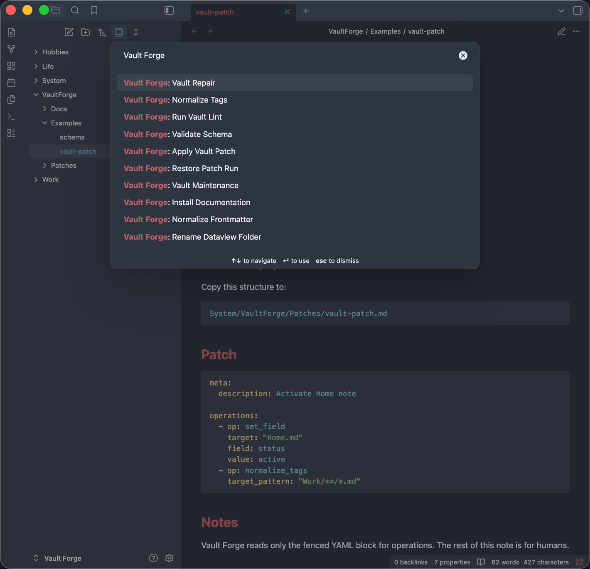
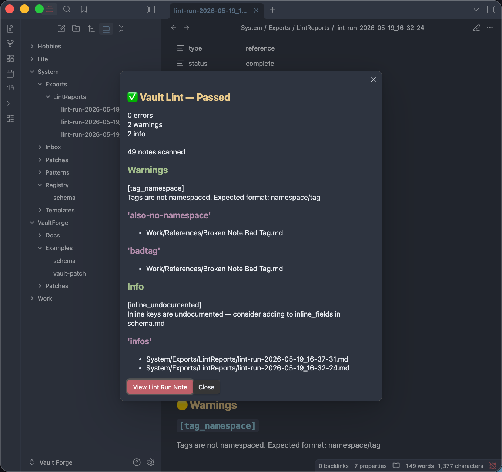
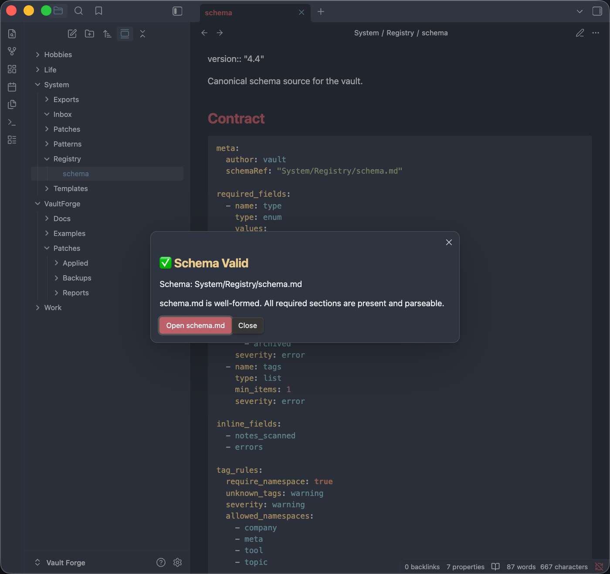
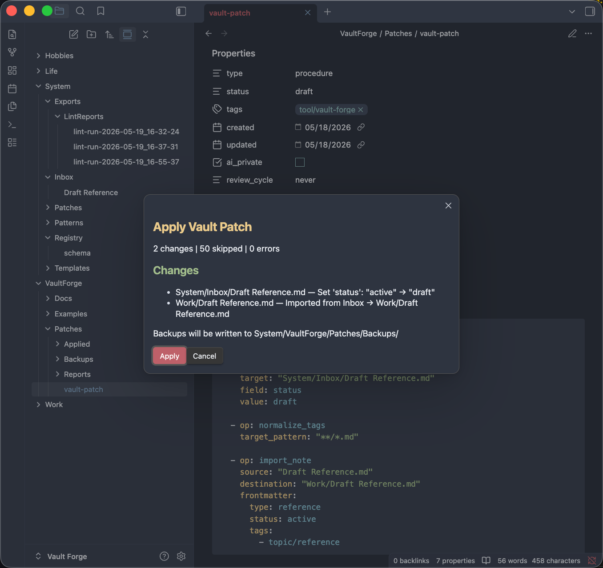
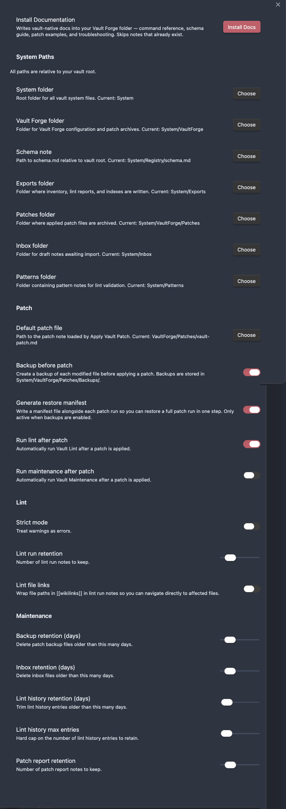

# Vault Forge

Schema-driven vault governance for Obsidian.

Vault Forge helps you lint, validate, normalize, repair, and maintain long-lived Obsidian vaults using structured operations and repeatable workflows.

Designed for users who treat their vault like durable infrastructure.

---



Vault Forge treats vault maintenance as an explicit operational workflow.

---

## What Vault Forge Does

Vault Forge provides operational tooling for Obsidian vault maintenance:

- Schema validation
- Vault linting
- Frontmatter normalization
- Tag normalization
- Patch operations
- Repair workflows
- Maintenance routines
- Dataview-safe folder operations
- Vault-native documentation installation

Think of it as:

> ESLint + migrations + maintenance tooling for your Obsidian vault.

---

## Best Fit

Vault Forge is especially useful for:

- Large or long-lived vaults
- Structured PKM systems
- PARA-style organizations
- Dataview-heavy workflows
- Research repositories
- Shared/team vaults
- Knowledge engineering workflows
- Metadata-driven note systems

---

# Installation

## Community Plugins

**Not yet available**

---

## Manual Installation

Copy the following files into:

```text
.obsidian/plugins/vault-forge/
```

Files:

```text
manifest.json
main.js
styles.css
```

Then reload Obsidian and enable the plugin.

---

# Quick Start

After enabling the plugin, run:

```text
Vault Forge: Install Documentation
```

Vault Forge installs vault-native documentation and examples into your configured Vault Forge folder.

Typical structure:

```text
System/VaultForge/
├── Docs/
├── Examples/
├── Patches/
```

Recommended reading order:

1. 0.START-HERE.md
2. 1.Installation.md
3. 2.Vault-Structure.md
4. 3.Schema.md
5. 4.Linting.md
6. 5.Patches.md
7. 6.Commands.md
8. 7.Settings.md
9. 8.Troubleshooting.md

---

# Commands

| Command | Purpose |
|---|---|
| `Vault Forge: Apply Vault Patch` | Apply structured vault operations from the configured patch note |
| `Vault Forge: Run Vault Lint` | Validate vault structure against the configured schema |
| `Vault Forge: Validate Schema` | Validate schema structure and configuration |
| `Vault Forge: Normalize Tags` | Sort and deduplicate frontmatter tags |
| `Vault Forge: Normalize Frontmatter` | Reorder frontmatter fields into canonical order |
| `Vault Forge: Vault Maintenance` | Run maintenance routines for operational files |
| `Vault Forge: Vault Repair` | Generate repair patches from lint results |
| `Vault Forge: Restore Patch Run` | Restore files from a previous patch backup manifest |
| `Vault Forge: Rename Dataview Folder` | Update Dataview folder references after folder changes |
| `Vault Forge: Install Documentation` | Install vault-native docs and examples |

---

# Core Concepts

## Schema Validation

Vault Forge validates notes against a configurable schema.

Schemas define:

- required metadata
- allowed values
- tag rules
- lint severity
- operational expectations

Example:

```yaml
required_fields:
  - name: status
    type: enum
    values:
      - draft
      - active
      - archived
```

Schemas provide the structural foundation for linting, repair workflows, normalization, and patch operations.

---

## Vault Linting

Linting validates notes against the configured schema.

Vault Forge can detect:

- missing frontmatter
- invalid enum values
- malformed metadata
- inconsistent tags
- schema violations
- metadata drift

Linting helps maintain long-term structural consistency across the vault.

---

## Normalization

Normalization standardizes metadata formatting.

Examples include:

- sorting tags
- deduplicating tags
- reordering frontmatter
- standardizing field values

This improves Dataview consistency and reduces structural drift over time.

---

## Vault Patches

Patches are explicit vault operations stored as markdown notes.

Vault Forge uses patches for:

- metadata repair
- tag normalization
- vault migrations
- note movement
- repeatable maintenance workflows

Example:

````md
# Patch

```yaml
operations:
  - op: set_field
    target: "Home.md"
    field: status
    value: active
```
````

Patch operations remain reviewable, auditable, and restorable.

---

# Documentation

Vault Forge installs vault-native operational documentation and examples directly into your vault.

Documentation includes:

- onboarding notes
- schema documentation
- linting workflows
- patch workflows
- troubleshooting guidance
- operational examples

Documentation intentionally lives inside the vault so it remains:

- searchable
- linkable
- syncable
- reviewable

---

# Safety Philosophy

Vault Forge is designed for long-term vault maintenance.

The plugin emphasizes:

- Predictable operations
- Structured workflows
- Explicit reviewable changes
- Repairability
- Operational visibility
- Repeatability

You remain in control of vault modifications.

Recommended practices:

- Use Git for large vaults
- Backup before major patch operations
- Test schemas incrementally
- Run linting before patching

---

# Screenshots

## Vault Lint

Detect schema violations, metadata drift, invalid tags, and structural inconsistencies.



---

## Schema Validation

Define explicit metadata contracts and validate vault structure against a canonical schema.



---

## Patch Operations

Apply reviewable vault operations with backups, reports, and restore manifests.



---

## Settings

Configure system paths, patch behavior, linting rules, backups, and maintenance retention.



---

# Development

```bash
npm install
npm run build
```

Release builds are generated from the plugin root and packaged as release assets.

---

# Philosophy

Knowledge systems decay over time.

Vault Forge exists to help long-lived Obsidian vaults remain:

- Structured
- Queryable
- Repairable
- Consistent
- Maintainable

Treat your vault like durable infrastructure instead of disposable notes.

---

# License

MIT